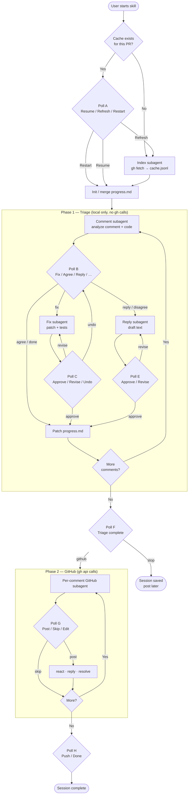
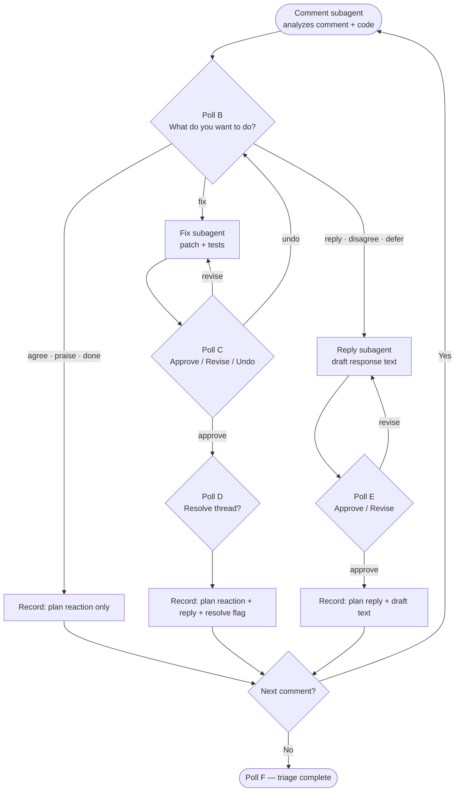

# Review PR Comments Together

Interactive walkthrough for pull request review comments — built to **learn from feedback**, not to auto-fix a PR and move on.

## Origin story

This skill came out of working through a real PR review: a Terraform Provider where a reviewer with a couple of years of Go experience left dozens of line-level comments.

At first the plan was to let an agent handle the whole review. That would work, but I would not learn much about *why* the feedback was given or what to watch for on the next PR.

The other option was to go through every comment manually in chat. That teaches you, but it is slow, repetitive, and easy to lose track of what you already decided.

So I built something in the middle: a skill that goes to GitHub, reads the comments, and walks through them with me **one at a time** — explaining what the reviewer likely means (a lot of comments are terse or assume context I do not have), suggesting concrete improvements, and asking what I want to do before anything gets changed or posted.

## How it works

1. **Fetch once, work locally** — an index subagent pulls comments from GitHub into a local cache. No re-fetching on every comment.
2. **Explain, then ask** — for each comment, a dedicated subagent reads the nearby code, explains the feedback, and proposes options. The orchestrator runs a poll so I choose — fix, agree, reply, defer — instead of typing free-form answers every time.
3. **Learn while shipping** — I stay in the loop on every decision; the agent does the heavy lifting (analysis, patches, reply drafts, `gh` in phase 2).

## Overview flow

The skill has two distinct phases separated by a checkpoint poll. Phase 1 is entirely local — no GitHub calls — so you can think, revise, and change your mind freely. Phase 2 is when decisions actually get posted.

The key design choice is the **poll at every decision point**. Rather than having the agent decide on your behalf, each poll hands control back to you — and because no GitHub calls happen until Phase 2, every decision in Phase 1 is reversible.

## Triage decision loop

Each comment goes through the same branching loop. The three main paths — fix, agree, reply — each have their own approve/revise cycle before anything is recorded.

A few things worth noting about this loop:

- **Undo is always available** — Poll C lets you go back to Poll B if the fix subagent's patch isn't what you wanted. Nothing is committed until you approve.
- **Fix and reply are independent** — the skill doesn't assume a fix means you don't also want to reply, or vice versa. The planned GitHub actions are recorded separately and composed in Phase 2.
- **Each subagent is isolated** — the fix subagent only sees the one comment and its surrounding code. It doesn't know what decisions you made on previous comments. This keeps each analysis clean and avoids context bleed.

## Architecture

The key idea is **subagent-first**: anything that is not polling or bookkeeping runs outside the orchestrator.

| Piece | Role |
|-------|------|
| **Orchestrator** | Polls, decisions, progress file, spawns subagents |
| **Index** | Fetch PR comments → cache |
| **Comment** | Analyze one comment + nearby code |
| **Fix** | Patch + tests for one comment |
| **Reply** | Draft reply for one comment |
| **GitHub** | Post reactions, replies, resolves (phase 2) |

Each subagent gets a **fresh context**. The orchestrator never loads the full cache, never reads code, never calls `gh`. That keeps the main session's context window very small — almost no token waste on work that does not need to be there.

## Local cache & resume

Session state lives under `.cursor/local/` (gitignored, never committed):

| File | Purpose |
|------|---------|
| `review-pr-cache.jsonl` | Immutable comment data from GitHub |
| `review-pr-progress.md` | Decisions, planned GitHub actions, resume pointer |

Because comments and progress are cached:

- No need to hit GitHub again on every comment
- Jump to a new chat window and say **resume** — pick up at the first unfinished comment
- Start over without losing the fetched comments

Even when the original orchestrator session's context gets too large, the cache + progress file let you continue in a clean window.

## Two phases

| Phase | What happens |
|-------|----------------|
| **1 — Triage** | Analyze every comment, decide, implement fixes locally, draft replies. GitHub is planned only (`~` codes in progress), not called. |
| **2 — GitHub** | Post planned reactions, replies, and resolves — one GitHub subagent per comment. |

The phase boundary is intentional: you can finish all of Phase 1 in one sitting, review the planned actions in `progress.md`, and only then run Phase 2 — or hand it off to a different session entirely.

## Usage

Install from this repo (see root [README](../../README.md)), then in any project with an open PR:

- "Walk me through the PR review"
- "Go over comments one by one"
- "Let's resolve comments together"

Agent instructions: [`SKILL.md`](SKILL.md)