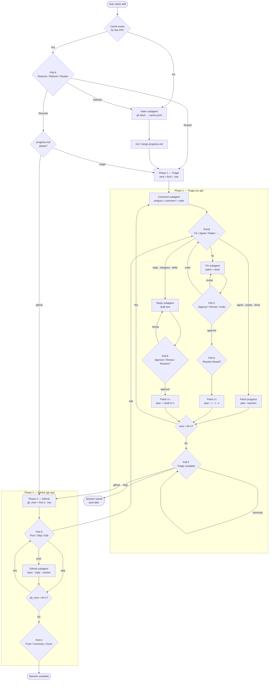
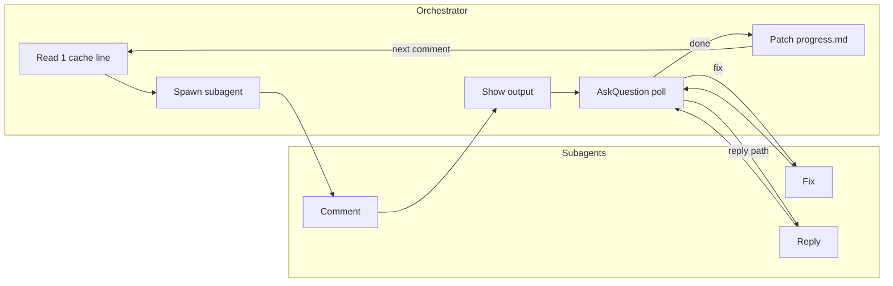
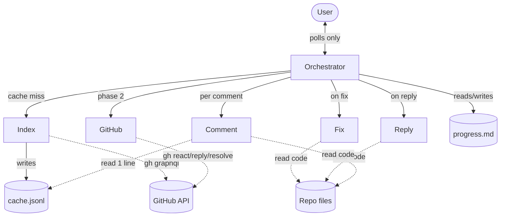
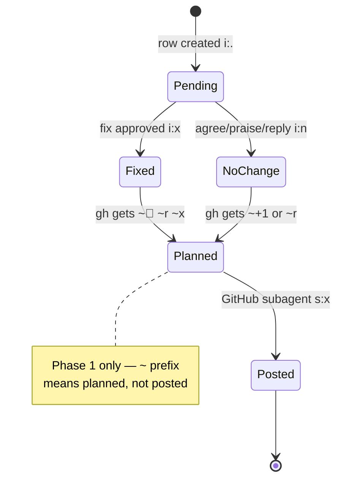

# Review PR Comments Together

Background and motivation: [README.md](README.md)

## Roles at a glance

| Agent | Job | Never |
|-------|-----|-------|
| **Orchestrator** | Spawn subagents · **run AskQuestion polls** · record decisions · maintain checklist + `progress.md` · read one cache line per spawn | Read code · analyze comments · draft text · implement fixes · call `gh` · load full cache or full progress table |
| **Index** | Fetch PR via `gh` · write cache · return slim index | Analyze · post to GitHub |
| **Comment** | Analyze one comment + nearby code | See other comments · fix code · post to GitHub |
| **Reply** | Draft reply text for one comment | Post to GitHub · fix code |
| **Fix** | Patch + tests + suggested reply for one comment | See other comments · post to GitHub |
| **GitHub** | `gh api` react/reply/resolve for one comment (phase 2 only) | Analyze · change code |

**Subagent-first:** if a task can run in an isolated subagent, the orchestrator must spawn one. Spawn with the **Task** tool. Never resume a subagent for the next step.

---

## Two-phase session

| Phase | Goal | GitHub (`gh`) |
|-------|------|---------------|
| **1 — Triage** | Analyze every comment · record decisions · implement fixes · draft replies | **Never** — plan actions only (`~` prefix in progress) |
| **2 — GitHub** | Post planned reactions, replies, resolves | **Yes** — one GitHub subagent per comment |

**Phase 1 ends** when every row has `i ≠ .` (header `next = M+1`).  
**Phase 2 starts** when the user picks **Post to GitHub** in the triage-complete poll (or types an equivalent confirm).

After each triage decision the orchestrator says **one line**: `"Planned for GitHub phase: …"` — no `gh` calls.

---

## Flow overview (mermaid)

### Full session



### Per-comment triage (Phase 1 detail)



### Agent responsibilities



### Progress row lifecycle



---

## Poll-first UX (orchestrator)

**Always use the AskQuestion tool** when the user must choose — never end a turn with "what would you like to do?" free text. AskQuestion always includes **Other** for custom input; reserve that for edge cases.

| Rule | Detail |
|------|--------|
| **One poll per turn** | Post comment analysis (or fix/reply result), then one AskQuestion. Do not bundle unrelated questions. |
| **Recommended first** | Put the comment subagent's suggested resolution as option 1 with `(Recommended)` in the label. |
| **Short labels** | ≤60 chars; put detail in the analysis above the poll, not in option text. |
| **Map ids → progress** | Use the tables below; never invent new `d` codes. |
| **Free text fallback** | If the user replies in chat instead of clicking, treat it like **Other** and continue. |

### Poll A — Session start (cache hit only)

When cache exists and user did not say "refresh":

| id | Label |
|----|-------|
| `resume` | Resume where we left off (Recommended) |
| `refresh` | Refresh comments from GitHub |
| `restart` | Restart triage from comment 1 |

### Poll B — Triage decision (after every comment subagent)

Build options from the comment subagent's **Poll options** block (2–5 items). Always include applicable standard ids; omit ids that don't fit.

| id | Label pattern | `d` | `i` | Next subagent |
|----|---------------|-----|-----|---------------|
| `fix` | Fix: {short summary} | `f` | `.` → `x` after fix | Fix |
| `agree` | Agree — no change needed | `a` | `n` | — |
| `praise` | Praise — thanks, no change | `a` | `n` | — |
| `reply` | Reply only — no code change | `r` | `n` | Reply |
| `disagree` | Disagree — reply explaining why | `d` | `n` | Reply |
| `defer` | Defer — handle in a follow-up | `~` | `n` | Reply |
| `done` | Already fixed / addressed | `a` | `n` | — |

**AskQuestion example** (orchestrator fills `options` from Poll options; first = recommended):

```
title: "Comment {index} of {total}"
prompt: "How should we handle @{u}'s feedback on {basename}:{l}?"
questions: [{ id: "action", options: [ …from comment subagent poll block… ] }]
```

### Poll C — After fix subagent

| id | Label | Effect |
|----|-------|--------|
| `approve` | Approve fix — continue (Recommended) | Patch `i:x`, planned `gh`; optional Poll D |
| `revise` | Revise — try a different approach | Re-spawn Fix with `User notes: revise — {Other text}` |
| `undo` | Skip fix — pick a different triage action | Reset row `i:. d:—`, re-run Poll B |

### Poll D — Resolve thread? (after `approve` on Poll C, or when fix + resolve is ambiguous)

Only when planned actions include a reply and resolve is not obvious.

| id | Label | `gh` addition |
|----|-------|---------------|
| `resolve_yes` | Yes — resolve thread after reply (Recommended for shipped fixes) | add `~x` |
| `resolve_no` | No — leave thread open | no `~x` |

Skip Poll D when praise/agree (no reply) or user already chose defer.

### Poll E — After reply subagent

| id | Label | Effect |
|----|-------|--------|
| `approve` | Approve reply — continue (Recommended) | Store draft in `n`, patch row, advance |
| `revise` | Revise — regenerate reply | Re-spawn Reply with `User notes: revise — {Other}` |
| `resolve_yes` | Approve and resolve thread | add `~x` to `gh` |
| `resolve_no` | Approve but leave thread open | no `~x` |

Combine `approve` + resolve into one poll when possible (`allow_multiple: true` on resolve only if the UI supports it cleanly; otherwise use Poll D).

### Poll F — Triage complete

| id | Label | Effect |
|----|-------|--------|
| `github` | Post everything to GitHub now (Recommended) | `phase:github`, start at `gh_next` |
| `summary` | Show triage summary first | Print checklist; re-poll with `github` / `stop` |
| `stop` | Stop here — I'll post to GitHub later | End session; progress saved |

### Poll G — GitHub phase (per comment, before spawning GitHub subagent)

| id | Label | Effect |
|----|-------|--------|
| `post` | Post as planned (Recommended) | Spawn GitHub subagent |
| `skip` | Skip this comment on GitHub | Patch `s:x`, clear pending `~` actions, advance |
| `edit` | Change plan before posting | Re-poll triage action (Poll B) for this row only |

Default: **auto-`post`** when user said "post all" / picked `github` on Poll F — only pause with Poll G if the row has `~r` and `n` is empty.

### Poll H — Session finish

| id | Label |
|----|-------|
| `push` | Push branch to remote |
| `summary` | Generate reviewer summary (markdown) |
| `done` | Done — nothing else (Recommended) |

---

## Session files — never commit

Both live under `.cursor/local/` (gitignored). Never stage or commit them.

| File | Role |
|------|------|
| `review-pr-cache.jsonl` | Immutable comment data written by index subagent |
| `review-pr-progress.md` | Orchestrator decisions and session state |

**Orchestrator read rule:** use Read with `offset = index + 1`, `limit = 1` on the cache. Never load the full file or multiple lines at once.

### Cache — `review-pr-cache.jsonl`

Line 1 (header):
```json
{"v":1,"pr":2,"title":"…","url":"https://github.com/…/pull/2","state":"OPEN","head":"abc123","fetched":"2026-06-15T12:00:00Z","m":15}
```

Lines 2…M+1 (one comment each):
```json
{"i":1,"id":3413223024,"p":"internal/provider/foo.go","l":28,"u":"ozviran-matia","b":"**praise:** 💪","pid":null,"pb":null}
```

| Key | Field |
|-----|-------|
| `i` | index (1-based) |
| `id` | GitHub comment databaseId |
| `p` | file path |
| `l` | line |
| `u` | reviewer login |
| `b` | comment body (verbatim) |
| `pid` | `in_reply_to_id` or null |
| `pb` | parent body or null |

**Cache hit** (skip index subagent): header exists, `pr` matches, user did not say "refresh".  
**Cache miss** → spawn index subagent.

### Progress — `review-pr-progress.md`

Do **not** duplicate cache fields here (no IDs, links, bodies, full paths).

```markdown
<!-- LOCAL — DO NOT COMMIT -->
# PR #{number} | done:{D}/{M} | next:{N}
phase:{triage|github}
gh_next:{G}
lu:{ISO date}
cache: review-pr-cache.jsonl

| # | s | i | u | loc | d | gh | n |
|---|--:|--:|---|-----|---|----|---|
| 1 | . | . | alice | foo.go:28 | — | — | — |
```

**Header** (lines 1–6) is all the orchestrator reads on resume — never load the full table into context.

#### Column codes

| Col | Value | Meaning |
|-----|-------|---------|
| `i` | `.` | not implemented yet — resume starts here |
| `i` | `x` | fix applied (or user confirmed done) |
| `i` | `n` | no code change needed (praise / reply-only / defer) |
| `s` | `.` | GitHub not done yet |
| `s` | `x` | GitHub done |
| `d` | `—` `a` `f` `d` `r` `~` | no decision · agree · fix · disagree · reply-only · defer |
| `gh` | `—` | nothing planned or posted |
| `gh` | `~+1` `~♥` `~🚀` `~👀` | planned reaction (phase 1) |
| `gh` | `~r` | planned reply — draft stored in `n` |
| `gh` | `~x` | planned resolve (only if user confirmed) |
| `gh` | `+1` `♥` `🚀` `👀` `r` `x` | posted (phase 2) — combine: `🚀,r,x` |
| `loc` | `basename:line` | final path segment + line only |
| `n` | short text | user note / reply draft ≤80 chars |

#### Default planned GitHub actions (phase 1)

| Decision | `i` | planned `gh` |
|----------|-----|--------------|
| Agree / no-action / praise | `n` | `~+1` (praise → `~♥`) |
| Fix shipped | `x` | `~🚀,~r` |
| Disagree / reply-only / defer | `n` | `~r` (draft in `n`) |
| Resolve? | — | add `~x` only if user explicitly confirms |

#### Progress update rules

| When | Read | Write |
|------|------|-------|
| Session start / resume | Header lines 1–6 | — |
| After index subagent | — | Full file (compact table) |
| User decides (phase 1) | — | Patch one row + header `lu`, `next` |
| Fix subagent done | — | Patch one row `i:x`, planned `gh` + header `next`, `lu` |
| Triage complete | — | Header `phase:github`, `gh_next` |
| GitHub subagent done | — | Patch one row + header `done`, `gh_next`, `lu` |

**Init (fresh PR):** all rows `s:. i:. d:— gh:— n:—`, header `done:0/{M} | next:1 | phase:triage | gh_next:1`.  
**Refresh (same PR):** merge — preserve `i`, `d`, `gh`, `n`, `s` for existing rows; add new; drop removed. Never reset `i:x` or `i:n` to `.`.

---

## Orchestrator workflow

### 0 — Cache check

1. Read line 1 of `.cursor/local/review-pr-cache.jsonl` (if exists).
2. Read header lines 1–6 of `.cursor/local/review-pr-progress.md` (if exists).
3. **Cache hit:** `pr` matches + no refresh request → run **Poll A** unless user already said resume/refresh. If `phase:github` → resume phase 2 at `gh_next`. Else resume phase 1 at `next` (first `i:.`).
4. **Cache miss** → spawn index subagent.

### 1 — Index subagent

See [`agents/index.md`](agents/index.md) for the full spawn prompt.

After it returns: tell the user `PR #N has M comments. Starting comment {next}.` Initialize or merge `progress.md`. Spawn comment subagent at `next`.

### 2 — Comment subagent

Read cache line `{index + 1}` (limit 1). Build `html_url` as `{cache.url}#discussion_r{id}`.

See [`agents/comment.md`](agents/comment.md) for the full spawn prompt.

Orchestrator posts the subagent's output verbatim (must include the **Link** line), then immediately runs **Poll B** (AskQuestion). Do not ask the user to type their choice.

### 3 — User decides (phase 1)

Map the poll answer to `d` / `i` / planned `gh` (see **Poll-first UX** tables). Patch progress (one row + header), state planned GitHub action in one line, then:

| Poll B id | Next step |
|-----------|-----------|
| `agree` / `praise` / `done` | Next comment (spawn Comment subagent) |
| `fix` | Fix subagent → **Poll C** on return |
| `reply` / `disagree` / `defer` | Reply subagent (`Decision:` = id) → **Poll E** on return |

See [`agents/fix.md`](agents/fix.md) and [`agents/reply.md`](agents/reply.md).

After Poll C `approve` (and Poll D if needed) or Poll E `approve`: patch row, state planned action, spawn next Comment subagent.

### 4 — Triage complete → GitHub phase

When `next = M+1`: announce triage complete, run **Poll F**.

On `github`: set `phase:github`, set `gh_next` to first `s:.` row. For each comment run **Poll G** (or auto-`post`), then spawn GitHub subagent until `gh_next = M+1`.

See [`agents/github.md`](agents/github.md) for the GitHub subagent spawn prompt.

After each GitHub subagent: patch row (`s:x`, replace `~` codes with posted codes), bump `done`, advance `gh_next`.

### 5 — Finish

Summarize from header `done:{D}/{M}` and in-chat checklist. Run **Poll H**. Never commit session files.

---

## Checklist (orchestrator, in-chat)

One line per comment — updated after each decision:
```
- [x] Comment 1 — 👍 reacted
- [x] Comment 2 — fixed, replied, resolved
- [ ] Comment 3 — replied (deferred)
```
